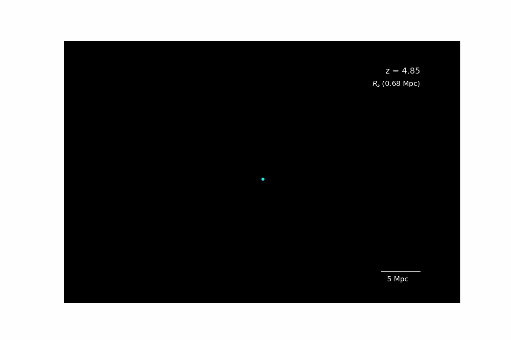

<p align="center">
  
</p>


# Cheetah: An Auto-Differentiable Gravity Simulation in JAX for Solving Relic Neutrino Trajectories


**Authors**:  
Nashwan Sabti, Keduse Worku, Marc Kamionkowski


**Contact Information**:  
- Nash Sabti – [nash.sabti@gmail.com](mailto:nash.sabti@gmail.com)  
- Keduse Worku – [kworku2@jhu.edu](mailto:kworku2@jhu.edu)  
- Marc Kamionkowski – [kamion@jhu.edu](mailto:kamion@jhu.edu)


If you found this code useful, please cite: [our arxiv link]


## Animations
Below are some animations showcasing the functionality of **Cheetah**:
**Individual Trajectories:**

Individual neutrino trajectories for R<sub>s</sub>/R<sub>200</sub>/R<sub>i</sub>.


**All Trajectories:**

All neutrino trajectories for R<sub>s</sub>/R<sub>200</sub>/R<sub>i</sub>


## Code Features
**Cheetah** is a code that quickly computes the clustering of neutrinos onto spherically symmetric dark-matter halos. The code calculates neutrino trajectories through backtracking from today (when z<sub>o</sub> is set to 0) to z<sub>i</sub> (corresponding to ~4.85). **Cheetah** is available in **JAX** and in **C** with a Python wrapper for user convenience. In both versions, users interact primarily through a main script which is supported by several subscripts.


The **JAX** version of Cheetah is highly parallelized and flexible, capable of generating neutrino profiles for a wide range of neutrino and dark-matter halo masses simultaneously. A fully self-contained `UNITS` module ensures that users only need to specify units at the beginning and end of the simulations — all intermediate unit conversions are handled automatically. Most parameters can be adjusted in the `input.py` subscript. It is important to note that choosing a wide range of neutrino masses requires a similarly broad range of neutrino momenta for proper phase space sampling. The total gravitational potential and DM profile can be modified in the `profiles.py` subscript, while the initial phase space of the neutrinos is governed by the `distributions.py` subscript. The main script also includes commented-out numerical checks.


In contrast, the **C** version is less flexible in terms of parameter choices but is highly optimized for speed for a single set of neutrino and DM halo masses. It returns neutrino density values for 100 radial points in just a few seconds, making it ideal for users seeking a ready-to-use code without modifications to the underlying physics. As with the JAX version, the main script includes commented-out numerical checks.


## How to Use the JAX Code
Most parameters can be altered in the input.py file within:


```bash
cd Cheetah_JAX/src
```


The code can be run with default parameters with:


```bash
cd Cheetah_JAX
python main.py
```


For each radial position at z<sub>o</sub>, Cheetah initializes runs for a range of velocities and angles to accurately sample the neutrino phase space distribution at z<sub>i</sub>. After the neutrino distribution at z<sub>i</sub> is calculated through:
```bash
result = solve_equations(time_span, ini_conds, args, time_eval)
u_sol = result.ys[-1, 2:] 
```
the results are fed into Liouville’s theorem to obtain the momenta distribution for all neutrino masses at z<sub>o</sub> through f_today =  f_FD at the end of my_function:
```bash
vmap(f_today, in_axes=(None, 0, None)) (f_FD, mass_array, jnp.sqrt(jnp.sum(jnp.power(u_sol, 2))),)
```
We then integrate across all momenta and angles for each radial position to estimate the mass density. This process is repeated for many radial positions (as well as neutrino and DM mass values) simultaneously to produce the output results in final_density_ratios.npy.


## How to Use the C Code
The easiest way to use the C code is through the notebook Cheetah_C/Python_wrapper.ipynb. 


The user is also able to compile the code directly through: 
```bash
cd Cheetah_C
clang nh.c -lm -o nh -O3
```
This produces the executable file nh. Then run:
```bash
\nh  M12 zo c mnu
```
in which M12 is halo mass in units of 10^{12} Msun, zo is the observed redshift, c is the concentration parameter, and mnu is neutrino mass in eV. One possible set of choices is:


```bash
\nh 1e3 0.0 4.5 0.3
```

